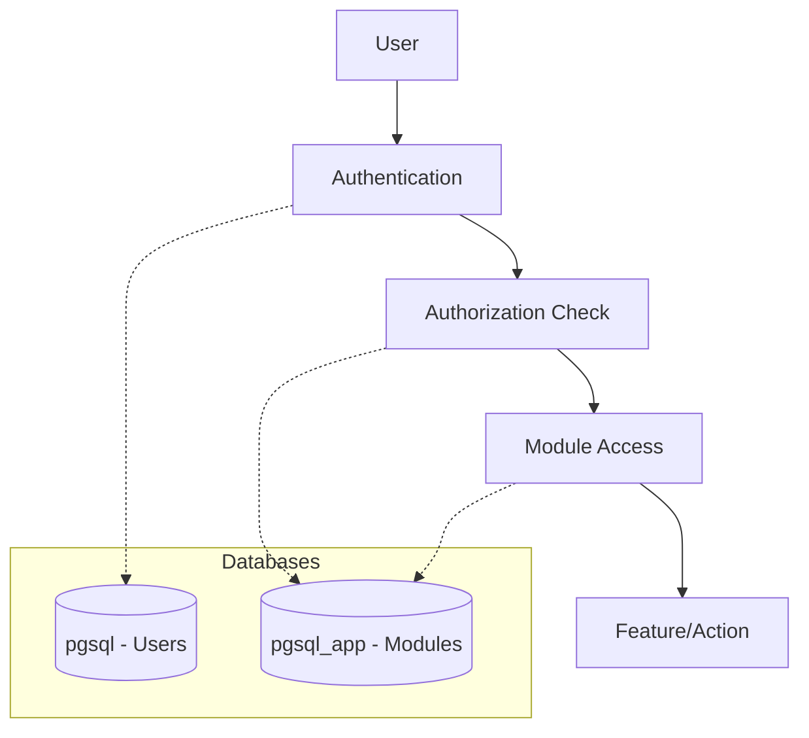
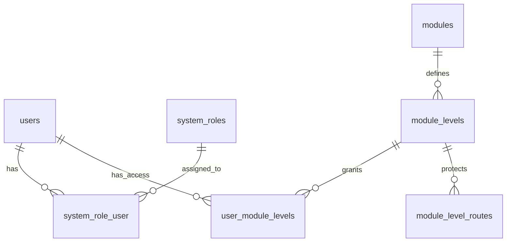
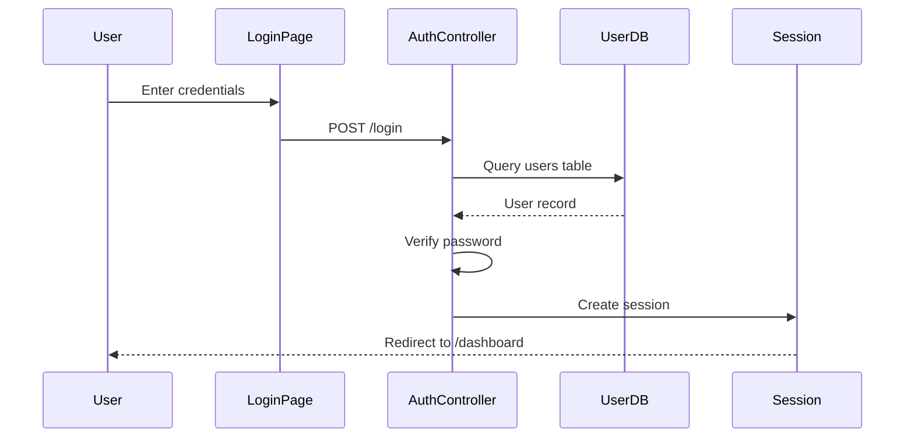
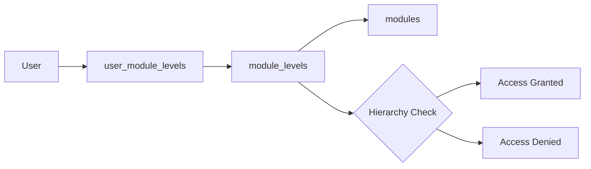
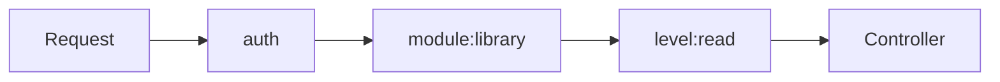
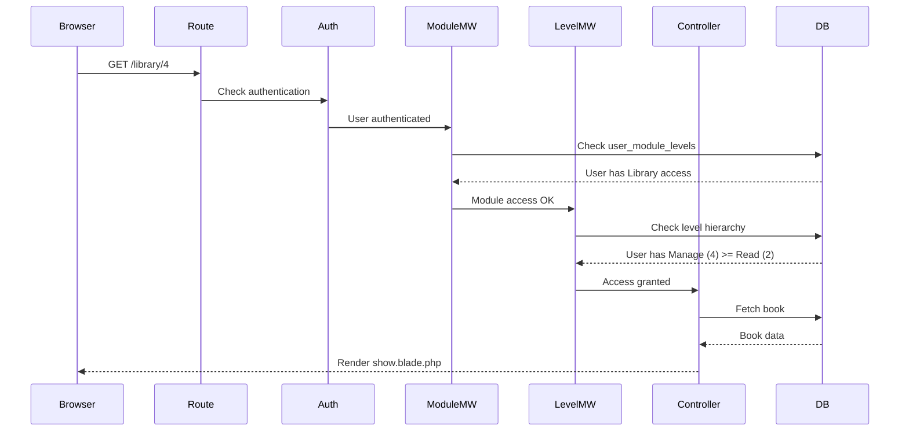

# eOffice Application Architecture & Flow

## Table of Contents
1. [System Overview](#system-overview)
2. [Database Architecture](#database-architecture)
3. [Authentication Flow](#authentication-flow)
4. [Authorization System](#authorization-system)
5. [Module System](#module-system)
6. [Request Flow Examples](#request-flow-examples)

---

## System Overview

eOffice is a modular document management system with:
- **Dual Database Architecture**: User data (PostgreSQL) + Application data (PostgreSQL)
- **Role-Based Access Control**: Admin vs Regular users
- **Module-Level Permissions**: Granular access control per module
- **Dynamic Module System**: Plug-and-play modules



---

## Database Architecture

### Two PostgreSQL Databases

#### 1. `pgsql` - User Database (Production)
**Tables:**
- `users` - User accounts (read-only in production)

**Purpose:** Connects to existing organizational user database

#### 2. `pgsql_app` - Application Database
**Tables:**
```
📊 Core Tables (13 total)
├── system_roles          - Admin/User roles
├── system_role_user      - User → Role assignments
├── modules               - Available modules
├── module_levels         - Access levels per module
├── module_level_routes   - Route permissions per level
├── user_module_levels    - User → Module access
├── books                 - Library module data
└── cache/jobs/migrations - Laravel system tables
```

### Database Schema Relationships



### Key Tables Explained

#### `system_roles`
```sql
id | name          | slug
---|---------------|-------
1  | Administrator | admin
2  | User          | user
```
**Purpose:** Define system-wide roles (admin vs regular user)

#### `modules`
```sql
id | name    | slug    | is_active
---|---------|---------|----------
1  | Library | library | true
2  | Example | example | true
```
**Purpose:** Registry of available modules

#### `module_levels`
```sql
id | module_id | name   | slug   | hierarchy
---|-----------|--------|--------|----------
1  | 1         | Browse | browse | 1
2  | 1         | Read   | read   | 2
3  | 1         | Write  | write  | 3
4  | 1         | Manage | manage | 4
```
**Purpose:** Define access levels for each module (hierarchical)

#### `user_module_levels`
```sql
id | user_id | module_level_id
---|---------|----------------
1  | 103     | 4              (Library - Manage)
2  | 103     | 7              (Example - Write)
```
**Purpose:** Grant specific access levels to users

---

## Authentication Flow

### Step-by-Step Login Process



**Code Flow:**

1. **User visits `/login`**
   - Route: `routes/web.php` → `AuthController@showLoginForm`
   - View: `resources/views/auth/login.blade.php`

2. **User submits credentials**
   ```php
   // AuthController.php
   public function login(Request $request) {
       $credentials = $request->only('username', 'password');
       
       if (Auth::attempt($credentials)) {
           // Success - create session
           return redirect()->intended('/dashboard');
       }
       
       return back()->withErrors(['Invalid credentials']);
   }
   ```

3. **Laravel checks `users` table (pgsql)**
   ```php
   // User.php model
   protected $connection = 'pgsql'; // Production user DB
   ```

4. **Session created**
   - User ID stored in session
   - Authentication guard: `web`

---

## Authorization System

### Two-Layer Authorization

#### Layer 1: System Role (Admin Check)

**Purpose:** Determine if user is administrator

```php
// User.php
public function isAdmin(): bool {
    return $this->systemRoles()
        ->where('slug', 'admin')
        ->exists();
}
```

**Database Query:**
```sql
SELECT * FROM system_role_user
WHERE user_id = 103
AND system_role_id = (SELECT id FROM system_roles WHERE slug = 'admin')
```

**Usage:**
```php
// Sidebar.blade.php
@if(auth()->user()->isAdmin())
    <!-- Show admin links -->
@endif
```

#### Layer 2: Module-Level Access

**Purpose:** Control access to specific modules and features



**Access Levels (Hierarchical):**
1. **Browse** (1) - View list only
2. **Read** (2) - View details + Browse
3. **Write** (3) - Create/Edit + Read + Browse
4. **Manage** (4) - Delete + Write + Read + Browse

**Code Example:**
```php
// CheckLevelAccess middleware
public function handle($request, Closure $next, $requiredLevel) {
    $user = auth()->user();
    $module = Module::where('slug', $moduleSlug)->first();
    
    // Get user's level for this module
    $userLevel = $user->moduleLevels()
        ->where('module_id', $module->id)
        ->first();
    
    // Check hierarchy
    if ($userLevel->hierarchy >= $requiredLevel->hierarchy) {
        return $next($request); // Allow
    }
    
    abort(403); // Deny
}
```

---

## Module System

### Module Structure

```
app/Modules/Library/
├── Module.php              # Module configuration
├── Controllers/
│   └── LibraryController.php
├── Resources/
│   └── Views/
│       ├── index.blade.php
│       ├── show.blade.php
│       └── upload.blade.php
├── Services/
│   └── WatermarkService.php
└── routes.php              # Module routes
```

### Module Registration

**1. Module Configuration (`Module.php`)**
```php
class Module {
    const NAME = 'Library';
    const SLUG = 'library';
    const LEVELS = [
        'browse' => 1,
        'read' => 2,
        'write' => 3,
        'manage' => 4,
    ];
}
```

**2. Database Entry**
```sql
INSERT INTO modules (name, slug, is_active)
VALUES ('Library', 'library', true);
```

**3. Route Protection**
```php
// routes.php
Route::middleware(['auth', 'module:library', 'level:read'])
    ->get('/library/{id}', [LibraryController::class, 'show']);
```

### Middleware Chain



**Middleware Execution:**

1. **`auth`** - Verify user is logged in
2. **`module:library`** - Check user has ANY access to Library
3. **`level:read`** - Check user has READ level or higher

---

## Request Flow Examples

### Example 1: Viewing a Book (Library Module)

**URL:** `GET /library/4`

**Step-by-Step:**



**Database Queries:**

```sql
-- 1. Auth check
SELECT * FROM users WHERE userid = 103;

-- 2. Module access check
SELECT * FROM user_module_levels uml
JOIN module_levels ml ON uml.module_level_id = ml.id
JOIN modules m ON ml.module_id = m.id
WHERE uml.user_id = 103 AND m.slug = 'library';

-- 3. Level hierarchy check
SELECT hierarchy FROM module_levels
WHERE id = (SELECT module_level_id FROM user_module_levels WHERE user_id = 103);
-- Returns: 4 (Manage) >= 2 (Read required) ✓

-- 4. Fetch book
SELECT * FROM books WHERE id = 4;
```

### Example 2: Dashboard Module Display

**URL:** `GET /dashboard`

**Code Flow:**

```php
// routes/web.php
Route::get('/dashboard', function () {
    $user = Auth::user();
    
    // 1. Fetch user's module access
    $userModuleLevels = $user->moduleLevels()
        ->with(['module', 'level'])
        ->get();
    
    // 2. Build accessible modules array
    $accessibleModules = $userModuleLevels->map(function ($uml) {
        $slug = $uml->module->slug;
        $routeName = $slug . '.index';
        $url = Route::has($routeName) 
            ? route($routeName) 
            : url($slug);
        
        return [
            'name' => $uml->module->name,
            'description' => "Access Level: " . $uml->level->name,
            'route' => $url,
            'slug' => $slug,
        ];
    });
    
    // 3. Render dashboard
    return view('dashboard', [
        'accessibleModules' => $accessibleModules
    ]);
});
```

**Database Queries:**

```sql
-- Fetch user's modules with levels
SELECT 
    m.name as module_name,
    m.slug as module_slug,
    ml.name as level_name,
    ml.hierarchy
FROM user_module_levels uml
JOIN module_levels ml ON uml.module_level_id = ml.id
JOIN modules m ON ml.module_id = m.id
WHERE uml.user_id = 103 AND m.is_active = true;
```

**Result:**
```
Library    | library | Manage | 4
Example    | example | Write  | 3
```

### Example 3: Admin Toggling User Role

**URL:** `POST /admin/users/105/toggle-admin`

**Flow:**

```php
// UserManagementController.php
public function toggleAdmin($id) {
    // 1. Find admin role
    $adminRole = DB::connection('pgsql_app')
        ->table('system_roles')
        ->where('slug', 'admin')
        ->first();
    
    // 2. Check if user has admin role
    $hasAdmin = DB::connection('pgsql_app')
        ->table('system_role_user')
        ->where('user_id', $id)
        ->where('system_role_id', $adminRole->id)
        ->exists();
    
    // 3. Toggle
    if ($hasAdmin) {
        // Remove admin
        DB::connection('pgsql_app')
            ->table('system_role_user')
            ->where('user_id', $id)
            ->where('system_role_id', $adminRole->id)
            ->delete();
    } else {
        // Add admin
        DB::connection('pgsql_app')
            ->table('system_role_user')
            ->insert([
                'user_id' => $id,
                'system_role_id' => $adminRole->id,
                'created_at' => now(),
                'updated_at' => now(),
            ]);
    }
    
    return back()->with('success', 'Admin status updated');
}
```

---

## Summary

### Key Concepts

1. **Dual Database**: Users (pgsql) + Application (pgsql_app)
2. **Two-Layer Auth**: System roles (admin) + Module levels (browse/read/write/manage)
3. **Hierarchical Access**: Higher levels inherit lower level permissions
4. **Middleware Chain**: auth → module → level → controller
5. **Dynamic Modules**: Plug-and-play architecture

### Data Flow Pattern

```
User Login → Session Created → Dashboard Loads
    ↓
Query user_module_levels → Display accessible modules
    ↓
User clicks module → Middleware checks access
    ↓
Access granted → Controller executes → View renders
```

### Access Control Matrix

| User Type | System Role | Module Access | Can Do |
|-----------|-------------|---------------|--------|
| Admin | admin | Any | Everything + User Management |
| Regular User | user | Assigned modules only | Based on level (browse/read/write/manage) |

This architecture provides:
- ✅ Secure, granular access control
- ✅ Flexible module system
- ✅ Separation of concerns
- ✅ Easy to extend and maintain
